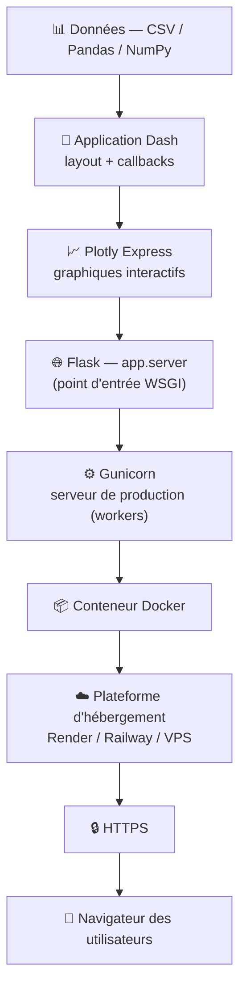
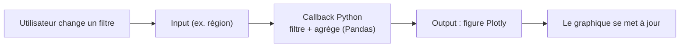
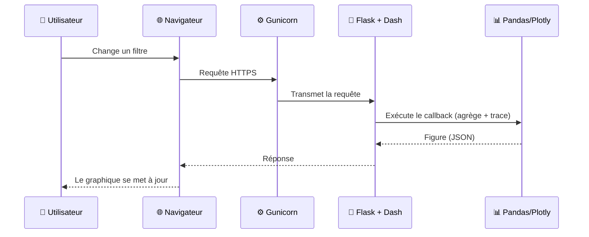
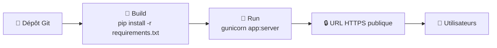

# 🎤 Prompt prêt à coller dans Gamma.ai

> Copiez **tout le bloc ci-dessous** (à partir de « Tu es un… ») et collez-le dans Gamma
> (mode « Texte → Présentation » / « Paste in text »). Gamma générera les diapositives.
> Les blocs `mermaid` peuvent être collés dans un bloc *diagramme* de Gamma, ou recréés
> par Gamma à partir de la description textuelle fournie juste au-dessus de chacun.

---

## ⬇️ DÉBUT DU PROMPT À COLLER

Tu es un concepteur de présentations techniques pédagogiques. Crée une présentation
professionnelle de **14 diapositives**, en **français**, au format **16:9**, intitulée
**« Déployer une application Dash en production — TP6 »**.

### Public et objectif
- Public : apprenants débutants/intermédiaires en data (aucun pré-requis DevOps).
- Objectif : faire comprendre, **brique par brique**, comment une application Dash passe
  de l'ordinateur du développeur (`localhost`) à une application web **sécurisée et partagée**.
- Ton : clair, pédagogique, concret. Une idée par diapo. Phrases courtes. Beaucoup de
  schémas et d'icônes, peu de texte dense.

### Charte graphique
- Couleur principale : bleu profond **#1F4E79**. Couleur d'accent : **#E76F51** (corail).
- Fond clair (#FCFCFD), titres en bleu, texte gris foncé. Police sans-serif (Inter/Arial).
- Style épuré, moderne, avec icônes par section et **un schéma sur les diapos clés**.

### Contexte technique (à respecter — ce sont les vraies briques du projet)
L'application est un tableau de bord commercial écrit en **Python**. Briques utilisées :
- **Pandas / NumPy** : chargement et agrégation des données (`data.py`, fonction `charger_donnees()`).
- **Plotly Express** : génération des graphiques interactifs (courbe, barres).
- **Dash** + **dash-bootstrap-components** : interface web (layout en grille) et interactions (callbacks).
- **Flask** : serveur web sous-jacent, exposé via `server = app.server`.
- **Gunicorn** : serveur WSGI de production (`gunicorn app:server`).
- **requirements.txt** : dépendances figées (reproductibilité).
- **Docker** (`Dockerfile`) + **Procfile** : empaquetage et déploiement portables.
- **Plateforme d'hébergement** : Render / Railway, ou Docker sur VPS, ou Dash Enterprise.
- **HTTPS** : accès chiffré. **dash-auth (BasicAuth)** : authentification optionnelle.
- **Partage** : bouton d'export CSV (`dcc.Download` + `dcc.send_data_frame`).
- **Gouvernance / RGPD** : bandeau « source · date de mise à jour · données agrégées ».

---

### PLAN DÉTAILLÉ DES 14 DIAPOSITIVES

**Diapo 1 — Titre**
Titre : « Déployer une application Dash en production ». Sous-titre : « TP6 — du localhost au
web sécurisé · Fil rouge Dataviz & Storytelling ». Visuel de fond abstrait tech/données.

**Diapo 2 — Le problème à résoudre**
« Mon dashboard tourne sur ma machine… comment le rendre accessible à toute l'équipe,
de façon fiable et sécurisée ? » Montrer le passage `localhost:8050` (1 personne) →
URL HTTPS publique (toute l'organisation). Icônes : 1 ordinateur → plusieurs utilisateurs.

**Diapo 3 — Vue d'ensemble : l'architecture en briques (SCHÉMA)**
Présenter l'empilement complet, du bas (données) vers le haut (utilisateur).
Description du schéma (pile en couches, de bas en haut) :
Données (CSV/Pandas) → Application Dash (layout + callbacks) → Plotly (figures) →
Flask (`app.server`) → Gunicorn (WSGI, plusieurs workers) → Conteneur Docker →
Plateforme cloud (Render/VPS) → HTTPS → Navigateur de l'utilisateur.

**Diapo 4 — Briques applicatives (le cœur Python)**
Tableau 2 colonnes (Brique | Rôle) :
Pandas/NumPy = charger et agréger les données ; Plotly Express = dessiner les graphiques ;
Dash = construire l'app web (layout + callbacks) ; dash-bootstrap-components = mise en page
responsive (grille, cartes KPI). Analogie : « le moteur et la carrosserie de la voiture ».

**Diapo 5 — Le concept clé : layout + callbacks**
Expliquer en 2 blocs : le **layout** (ce que l'on voit) et les **callbacks** (ce qui réagit).
Mini-schéma du flux : `Filtre (Input) → fonction Python → graphique (Output)`.

**Diapo 6 — Briques serveur : Flask, WSGI, Gunicorn**
Pourquoi Dash a besoin d'un serveur. Dash est bâti sur **Flask** ; on expose
`server = app.server`. En production, on ne lance jamais le serveur de développement :
on utilise **Gunicorn** (serveur WSGI) qui lance plusieurs *workers* pour tenir la charge.
Schéma : navigateur → Gunicorn (4 workers) → Flask → Dash.

**Diapo 7 — Dev vs Production (LE point à retenir)**
Tableau comparatif 2 colonnes :
- Développement : `python app.py` · `app.run(debug=True)` · 1 utilisateur · rechargement auto.
- Production : `gunicorn app:server --bind 0.0.0.0:8050 --workers 4` · multi-utilisateurs ·
  stable · pas de mode debug.
Message clé : « Le serveur de développement ne va JAMAIS en production. »

**Diapo 8 — Briques d'empaquetage : requirements, Docker, Procfile**
- `requirements.txt` : fige les versions → reproductible partout.
- `Dockerfile` : emballe l'app + ses dépendances dans une image portable.
- `Procfile` : indique à Render/Railway la commande de démarrage (Gunicorn).
Analogie : Docker = « un carton de déménagement standardisé : ça marche pareil partout ».

**Diapo 9 — Le cycle d'une requête (SCHÉMA de flux)**
Décrire, étape par étape, ce qui se passe quand l'utilisateur interagit.
Description du schéma (gauche → droite) : l'utilisateur clique un filtre → le navigateur
envoie une requête HTTPS → Gunicorn la transmet à Flask → Dash exécute le callback (Python)
→ Pandas agrège les données → Plotly produit la figure (JSON) → renvoyée au navigateur →
le graphique se redessine.

**Diapo 10 — Options de déploiement**
Tableau 3 colonnes (Plateforme | Pour qui | Principe) :
- Render / Railway : démo, MVP, projets perso — connecter un dépôt Git, `Procfile` détecté.
- Docker + VPS : entreprise, contrôle total — `docker build` puis `docker run -p 8050:8050`.
- Dash Enterprise : grands comptes — auth, scalabilité, support (payant).

**Diapo 11 — Le pipeline de déploiement (SCHÉMA)**
Décrire les 5 étapes en chaîne :
Code sur **Git** → la plateforme **build** (installe `requirements.txt`) → **lance** Gunicorn
(via `Procfile`) → expose une **URL HTTPS** → les **utilisateurs** accèdent.

**Diapo 12 — Partager les résultats : l'export**
Tout le monde ne se connectera pas à l'app. On ajoute un **bouton d'export CSV**
(`dcc.Download` + `dcc.send_data_frame`) qui télécharge les données filtrées.
Mentionner aussi les exports possibles : PNG (image), HTML autonome, Excel.

**Diapo 13 — Sécurité, gouvernance & RGPD**
3 piliers avec icônes :
1. **Sécurité** : HTTPS, secrets hors du code (variables d'environnement),
   authentification (`dash-auth` BasicAuth pour une démo ; comptes hachés + HTTPS en réel).
2. **Gouvernance** : une source de vérité, des KPI définis, un responsable par dashboard.
3. **RGPD** : données agrégées (pas de donnée personnelle), bandeau « source · date de
   mise à jour ». Avertissement : ne jamais exposer de données personnelles sur un dashboard public.

**Diapo 14 — Récap & checklist de mise en production**
Checklist à cocher :
☐ `server = app.server` exposé ☐ `requirements.txt` figé ☐ testé avec Gunicorn
☐ `Dockerfile` / `Procfile` prêts ☐ HTTPS actif ☐ accès protégé ☐ export disponible
☐ bandeau source/date/RGPD. Phrase de clôture : « Une donnée n'a de valeur que lorsqu'elle
est partagée — proprement et en sécurité. » Terminer par une diapo « Merci / Questions ».

---

### CONSIGNES FINALES POUR GAMMA
- Génère **exactement 14 diapositives** suivant ce plan.
- Sur les diapos 3, 5, 9 et 11, **inclus un schéma/diagramme** (utilise les blocs Mermaid
  fournis, ou recrée-les fidèlement à partir des descriptions).
- Limite le texte : titres courts + puces de 6 mots maximum + un visuel par diapo.
- Respecte la charte (bleu #1F4E79, accent #E76F51) et garde un style épuré et cohérent.

## ⬆️ FIN DU PROMPT À COLLER
